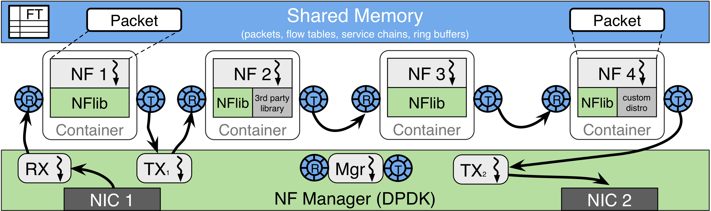

# onvm

This directory contains some explorative experimental results related to the high-speed OpenNetVM platform on a COTS server.
=======
## Introduction
This directory contains our explorative experiments of the state-of-the-art OpenNetVM (ONVM) [platform on a commodity off-the-shelf server. Our experiments focus on the performance diagnoses of ONVM. Please refer to the [main website]((https://github.com/sdnfv/openNetVM)) for further information. The general architecture of ONVM is illustrated below: 

The experiments include 5 different Service Function Chaining (SFC) configurations, namely:

1. Linear 
2. DAG-1 
3. DAG-2
4. Tree
5. Bridge

We conduct three types of experiments:

1. Load stimulus: Perturbing the input traffic with different input rates and patterns. 

2. Resource stimulus: Perturbing the allocated resource to individual VNFs. Currently, we assign collocated parasite processes to each VNF to perturb its CPU share.

3. The combination of the previous two experiments. 

Please refer to each SFC directory for data and further details. 

## How to interpret the data 

### CSV files for each experiment: 

#### Files omnipresent in all experiments: 
* __tx_stats__: Statistics for the input traffic. The input traffic was generated and recorded using the [MoonGen](https://github.com/emmericp/MoonGen.git) traffic generator. The generated synthetic packets follow either pure 128 B or the Internet IMIX distribution (i.e., 64B: 512B: 1024B = 7:4:1). Please refer to the *tx_stats.csv* file in each directory to check the packet size distribution. Normally, the packet rate of IMIX should not surpass 4 Mpps (i.e., million packets per second). A sample tx_stats record is illustrated below: 
  
| Time | Device | Direction | PacketRate | Mbit | MbitWithFraming | TotalPackets | TotalBytes |
|------|--------|-----------|------------|------|-----------------|--------------|------------|
|  1686141358 |	Device: id=0 |	TX	| 0.33343282345416 |	943.37429415621 |	996.72354590888	| 339888 |	120205980 |

* __rx_stats__: End-to-end throughput statistics are also measured and recorded using MoonGen. This file follows the same format as *tx_stats*. A sample rx_stats record is illustrated below:

| Time | Device | Direction | PacketRate | Mbit | MbitWithFraming | TotalPackets | TotalBytes |
|------|--------|-----------|------------|------|-----------------|--------------|------------|
| 1686141399 | Device: id=1	| RX |	0.18560265302008 |	525.69664884533	| 555.39307332854 |	15963959	| 5653132404 |

* __latency__: Statistics for the end-to-end latency. This is also measured using MoonGen by injecting PTP packets every second into the tx traffic. The latency is measured in nanoseconds.

| Sequence no. | Latency (ns) |
|--------------|--------------|
| 188 | 3765443 |

* __nf__: Statistics of individual VNFs measured by [Perf](https://perf.wiki.kernel.org/index.php/Main_Page). The interesting features include CPU frequency, l1-dcache-misses, and LLC cache references, and so on. 

#### Files specific to the ONVM platform
* __nf_out__: This file is output by ONVM to measure the statistics of the individual VNFs on a configured SFC. Some interesting statistics include the TX/RX rates, RX/TX counts, TX/RX drop rates, TX/RX drops. The column names are listed as follows:
> nfs[i].tag, nfs[i].instance_id, nfs[i].service_id, nfs[i].thread_info.core, rx_pps, tx_pps, rx, tx, act_out, act_tonf, act_drop, nfs[i].thread_info.parent, state, rte_atomic16_read(&nfs[i].thread_info.children_cnt), rx_drop_rate, tx_drop_rate, rx_drop, tx_drop, act_next, act_buffer, act_returned 

### Future (or ongoing) directions:
Please refer to our paper if you find this work interesting: 

Qiong Liu, Tianzhu Zhang, Leonardo Linguaglossa. "__Non-invasive performance prediction of high-speed softwarized network services with limited knowledge,__" IEEE International Conference on Computer Communications (INFOCOM), 2024.

Although we are happy about the outcome, this paper has several drawbacks:

1. Diverse NFV frameworks: Our current work mainly relies on openNetVM, and we should further consider other prevalent NFV frameworks, including FastClick, BESS, VPP, Snabb, F-Stack, Seastar, etc.
2. Extension to other profiling tools: There is a huge collection of system profiling tools beyond perf, e.g., Intel PCM and Intel VTune profiler; we should explore the space more extensively.
3. Explore the space of contention creation: provide more controlled means of contention injection to make the data more representative.
4. Experimentation with 25/40 Gbps NICs. Hopefully, we can afford a 100 Gbps card in the future :)
5. Performance diagnosis: detect possible contentions and performance bottlenecks. The interesting scenarios include DDIO contention, LLC contention, CPU share contention, inter-NUMA misconfiguration, etc. 
6. Polling vs. interrupt: Our current work focuses on poll-mode processing, with each VNF monopolizing a core. In the interrupt mode, multiple VNFs can share the same core. 
7. Run-to-completion vs. Pipeline: Our current work considers VNFs running in the pipeline mode. We will address the scenario where each SFC operates in the run-to-completion mode. 
8. Compatibility with virtualization techniques: How to realize the same data collection when the VNFs are running inside the virtual machines and containers. Our current work considers VNFs running as bare-metal processes.
9. Compatibility with cybersecurity measures: How to adapt our method to execution environments with protection mechanisms, e.g., Intel SGX and its variants?
10. Extension to other acceleration techniques: Our current work uses DPDK as the acceleration stack. We must consider other kernel-bypassing (e.g., Netmap, Snabbco, PF\_ring buffer) or in-kernel techniques (e.g., eBPF/XDP).

We are working hard to address all these drawbacks. Stay tuned!! 

### Collaboration Acknowledgement
This project involves a collaborative effort between Telecom Paris and Nokia Bell Labs. Our partnership reflects a shared commitment to advancing open-source software development, data science research, and applied AI/ML in networking. 

We extend our gratitude to all contributors and supporters who have made this project possible. If you would like more details, questions, or suggestions about our project, please feel free to contact us at qiong.liu@telecom-paris.fr or tianzhu.zhang@nokia.com.

